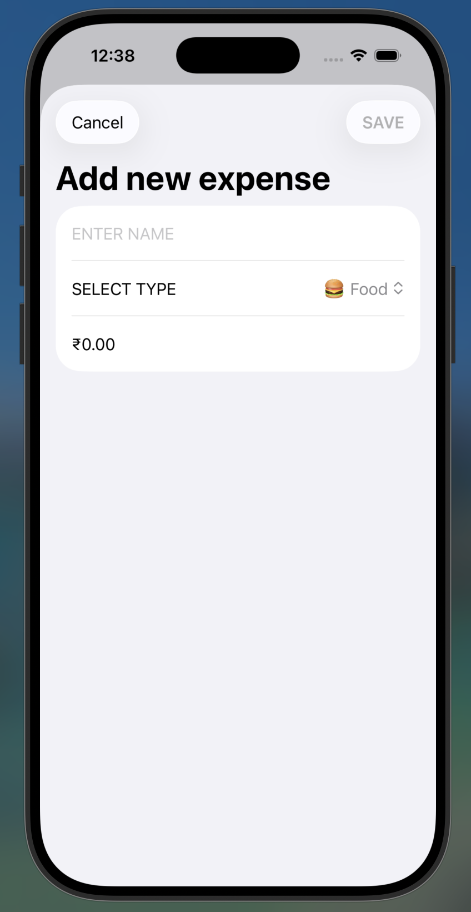
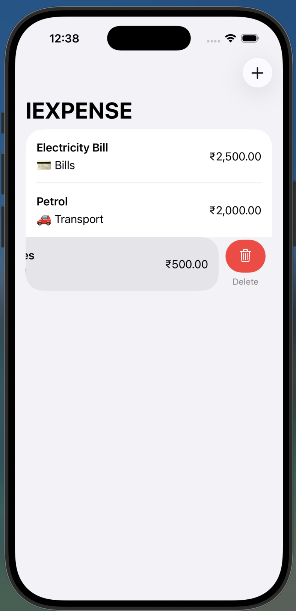

<div align="center">

# 💰 iExpense

**A lightweight iOS expense tracker built with SwiftUI**

</div>

---

## 📑 Table of Contents

- [Screenshots](#-screenshots)
- [Features](#-features)
- [Requirements](#-requirements)
- [Project Structure](#-project-structure)
- [How It Works](#-how-it-works)
- [Getting Started](#-getting-started)
- [Roadmap](#-roadmap)
- [License](#-license)

---

## 📸 Screenshots

<div align="center">

| Add Expense | Swipe to Delete |
|---|---|
|  |  |

</div>

---

## ✨ Features

- 📝 **Add expenses** through a modal form (name, category, amount)
- 🏷️ **Category picker** with emoji-labeled options
- 👆 **Swipe-to-delete** on the main list
- ✅ **Cancel or Save** — explicit Cancel (top-left) and Save (top-right) toolbar actions
- 🚫 **Input validation** — Save stays disabled until a name is entered **and** the amount is greater than zero
- 🌍 **Locale-aware currency formatting** — amounts render using the device's local currency automatically
- 💾 **Automatic persistence** — expenses are saved to `UserDefaults` as JSON and reloaded on next launch
- 🧠 Built with the `@Observable` macro for modern, lightweight state management

<details>
<summary>🏷️ See all available categories</summary>

| Emoji | Category |
|---|---|
| 🍔 | Food |
| 🚗 | Transport |
| 🏠 | Home |
| 🛍️ | Shopping |
| 🎮 | Entertainment |
| 🏥 | Health |
| 📚 | Education |
| 💳 | Bills |
| 📦 | Other |

</details>

---

## 📋 Requirements

- Xcode 15 or later
- iOS 17.0+
- Swift 5.9+

---

## 🗂 Project Structure

```
ExpenseTracker/
├── ContentView.swift   # Main list view + Expenses data model
└── AddView.swift       # Form for adding a new expense
```

<details>
<summary><code>ContentView.swift</code></summary>

<br>

- Defines `ExpenseItem`, a `Codable`, `Identifiable` struct representing a single expense (`id`, `name`, `type`, `amount`).
- Defines `Expenses`, an `@Observable` class holding the list of items. Any change to the list triggers `didSet`, which re-encodes it to JSON and writes it to `UserDefaults`.
- `ContentView` renders all expenses in a `List`, supports swipe-to-delete, and presents `AddView` as a sheet from the **ADD ITEM** toolbar button.

</details>

<details>
<summary><code>AddView.swift</code></summary>

<br>

- A `Form` with a name field, a category `Picker`, and a currency-formatted amount field using a decimal keypad.
- Toolbar has two explicit actions:
  - **Cancel** (`.cancellationAction`) — dismisses the sheet without saving.
  - **SAVE** (`.confirmationAction`) — builds a new `ExpenseItem`, appends it to the shared `Expenses` object, and dismisses.
- Save button validation:

  ```swift
  .disabled(name.trimmingCharacters(in: .whitespaces).isEmpty || amount <= 0)
  ```

  Save stays greyed out until **both** conditions are met — a non-empty name and an amount greater than zero.

</details>

---

## ⚙️ How It Works

1. On launch, `Expenses.init()` tries to load and decode previously saved items from `UserDefaults`.
2. Adding an expense in `AddView` appends a new `ExpenseItem` to the shared `expenses.items` array.
3. Any mutation to `items` fires `didSet`, re-encoding the full array to JSON and saving it under the `"Items"` key in `UserDefaults`.
4. `ContentView` updates automatically since `Expenses` is `@Observable` and `items` drives the `List`.

<details>
<summary>💾 Persistence flow diagram</summary>

```
App launch
   │
   ▼
Expenses.init() ──► reads "Items" from UserDefaults ──► decodes JSON ──► items[]
   │
   ▼
User taps "ADD ITEM" ──► AddView sheet ──► fills form ──► taps SAVE
   │
   ▼
expenses.items.append(newItem)
   │
   ▼
didSet fires ──► encodes items[] to JSON ──► writes to UserDefaults
```

</details>

---

## 🚀 Getting Started

1. Open the project in Xcode.
2. Select an iOS 17+ simulator or device.
3. Build and run (`⌘R`).
4. Tap **ADD ITEM**, fill in a name / category / amount, and tap **SAVE** — or **Cancel** to back out.

---

## 🛣 Roadmap

Ideas for where this project could go next:

- [ ] Summary/breakdown view showing total spend per category
- [ ] Edit support for existing expenses (currently add/delete only)
- [ ] Migrate storage from `UserDefaults` to SwiftData for larger histories
- [ ] Sort/filter expenses by category or date
- [ ] Monthly spending charts

---

## 📄 License

Personal / learning project. No license specified.

